# Neural Style Transfer

TensorFlow implementation of "A Neural Algorithm of Artistic Style" by 
Leon A. Gatys, Alexander S. Ecker, Matthias Bethge (https://arxiv.org/abs/1508.06576).


Using a pre-trained convolutional neural network, we combine the content of an image and
the style of another to generate a new image.

## Dependencies

Numpy

Scipy

TensorFlow

PIL

Matplotlib

imageio


## Usage on Tresorio platform


Step 1: Download pre-trained VGG-19 model (available at http://www.vlfeat.org/matconvnet/models/imagenet-vgg-verydeep-19.mat),
and add it as a new dataset on the Tresorio platform

Step 2: Add two dataset files on the Tresorio platform for the content and style images you wish to run Neural Style Transfer on

Step 3: Link your dataset(s) to this simple_neural_style_transfer project

Step 4: Start a training with Tresorio with the following commands:
```
pip install -r requirements.txt
python run.py --vgg_model /app/datasets/pretrained-model/imagenet-vgg-verydeep-19.mat
--content_image /app/datasets/images/content_image.jpg --style_image /app/datasets/images/style_image.jpg
```

(In this example, the vgg-model and the style/content images are stored in separate datasets, "pretrained-model"
and "images" respectively)

Step 5: Download training results and get image at "artifacts/generated_image.jpg"


## Configurable parameters

Configurable parameters in code include:

- output image width/height (config.py: CONFIG.IMAGE_WIDTH, CONFIG.IMAGE_HEIGHT)
- layer(s) used for content cost (run.py: CONTENT_LAYER)
- layer(s) used for style cost (run.py: STYLE_LAYERS)
- alpha/beta/gamma for total cost function (run.py: alpha, beta, gamma)


## Examples


<div align="center">

</div>

<div align="center">
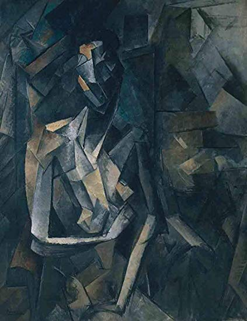
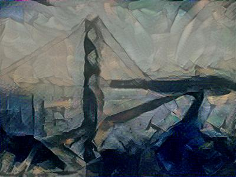

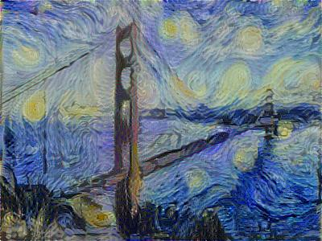
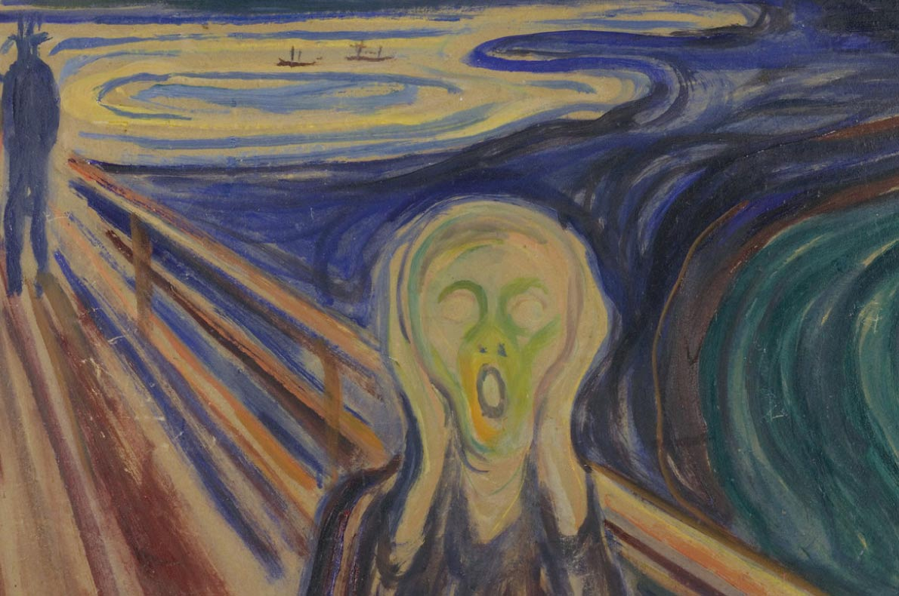
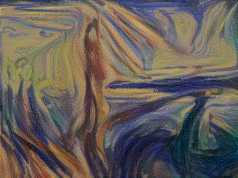
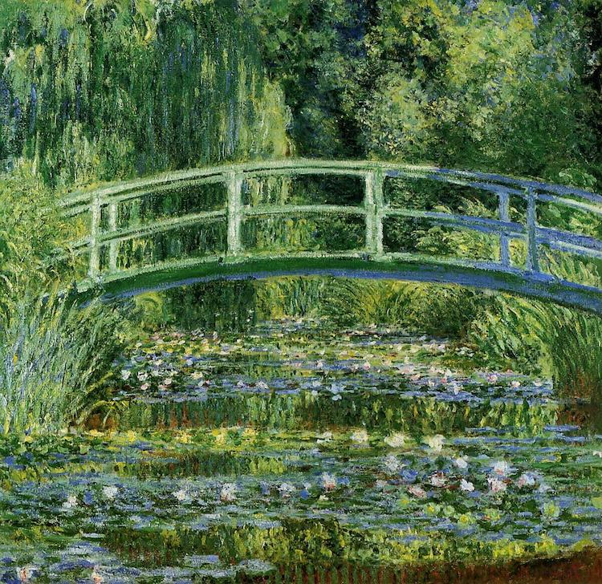
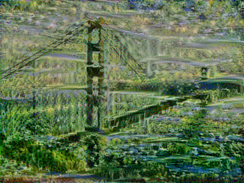
</div>

<div align="center">
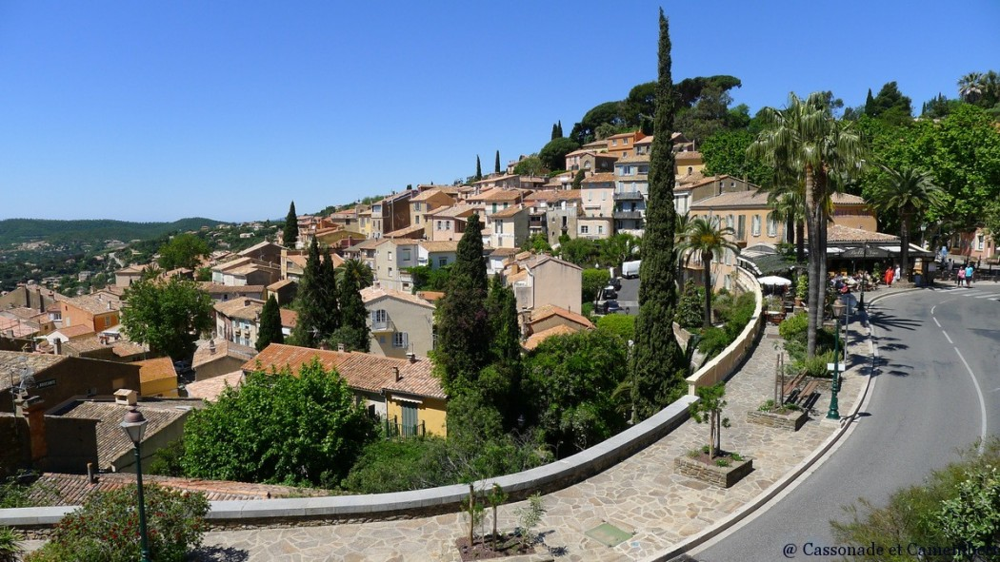
</div>

<div align="center">
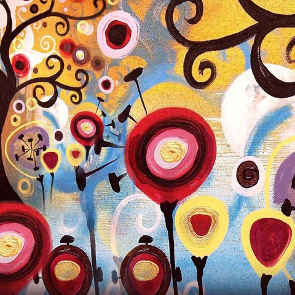
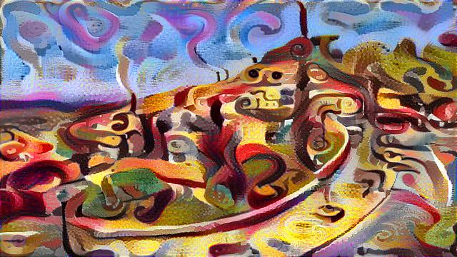

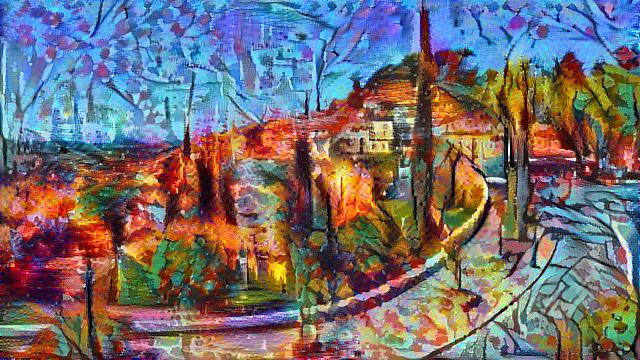

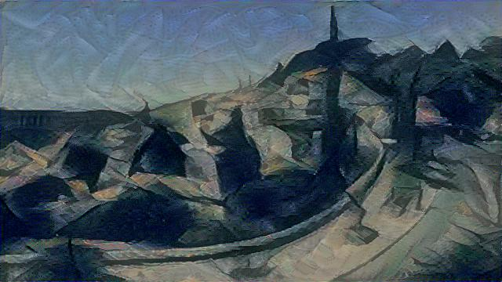

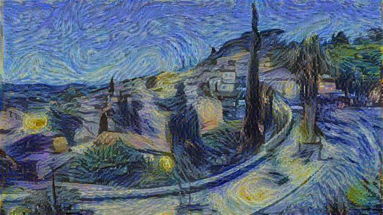
</div>

<div align="center">

</div>

<div align="center">
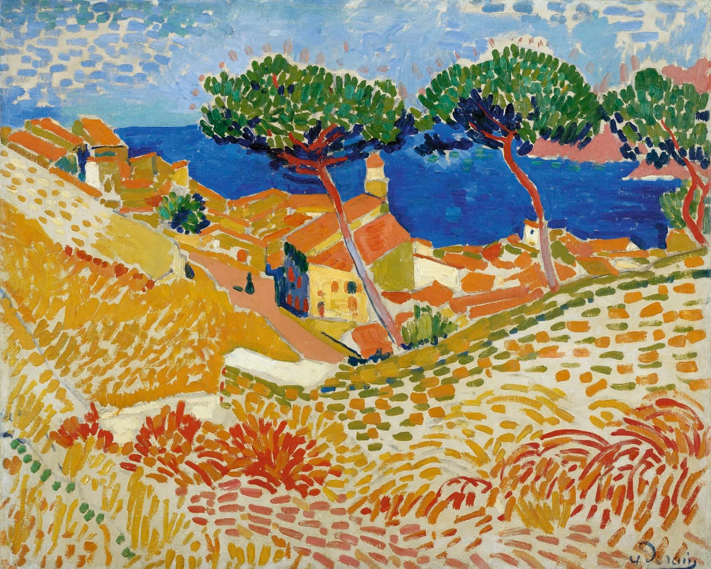
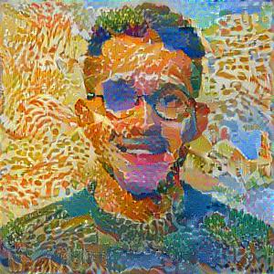
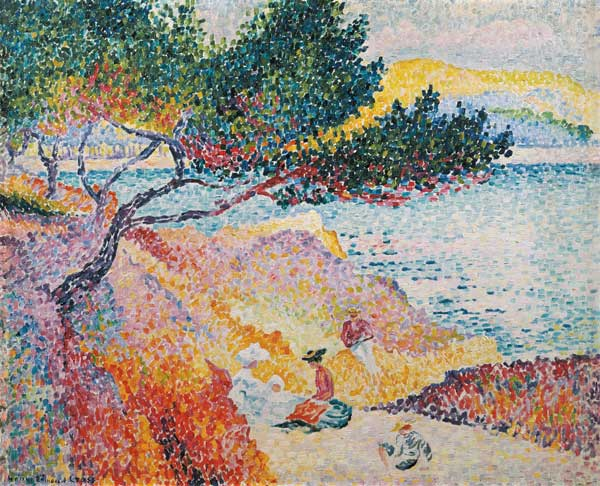
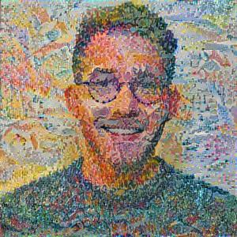
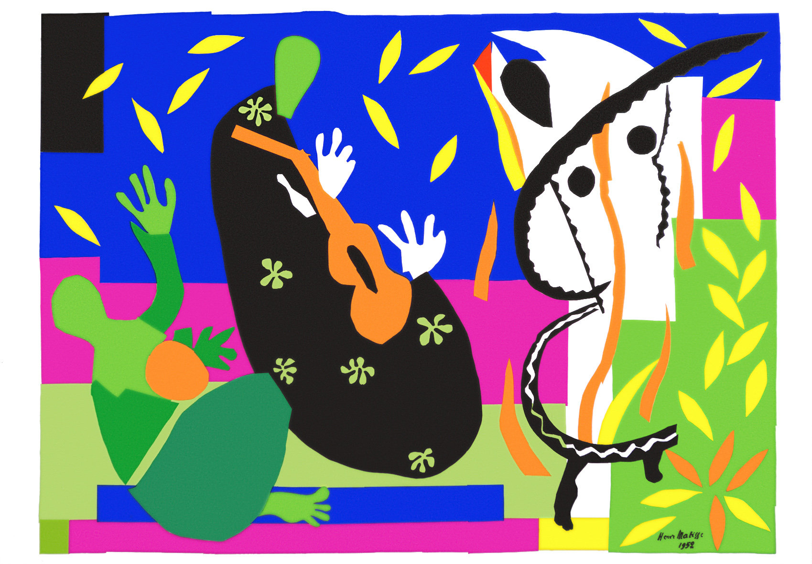
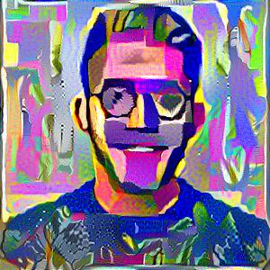
</div>


<div align="center">
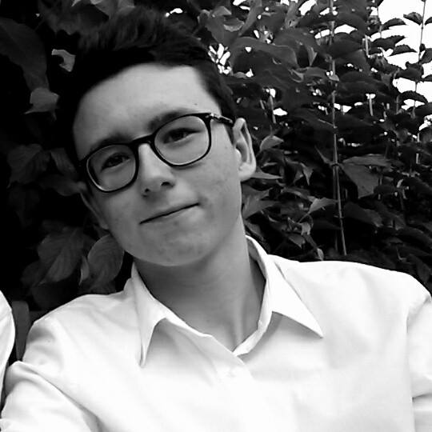
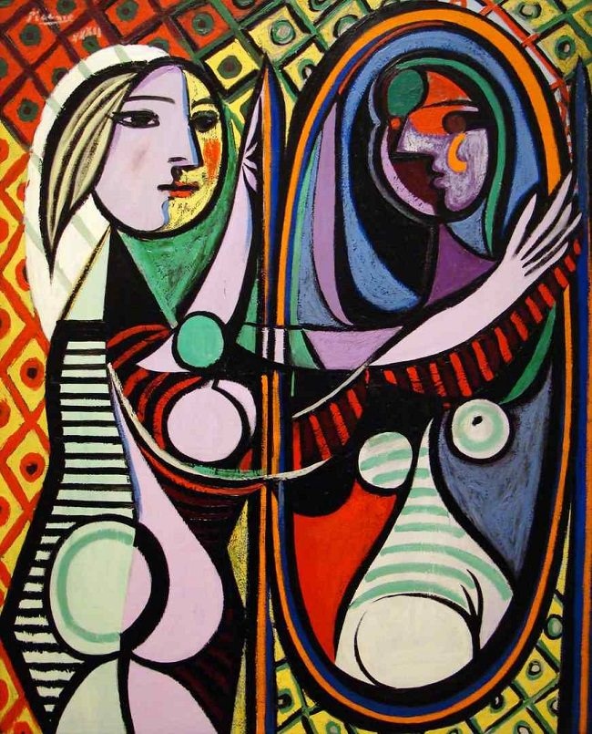
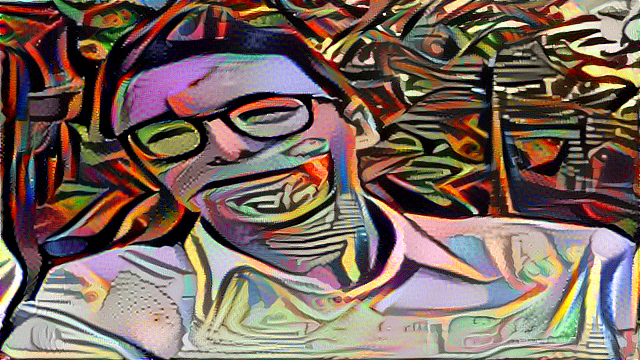
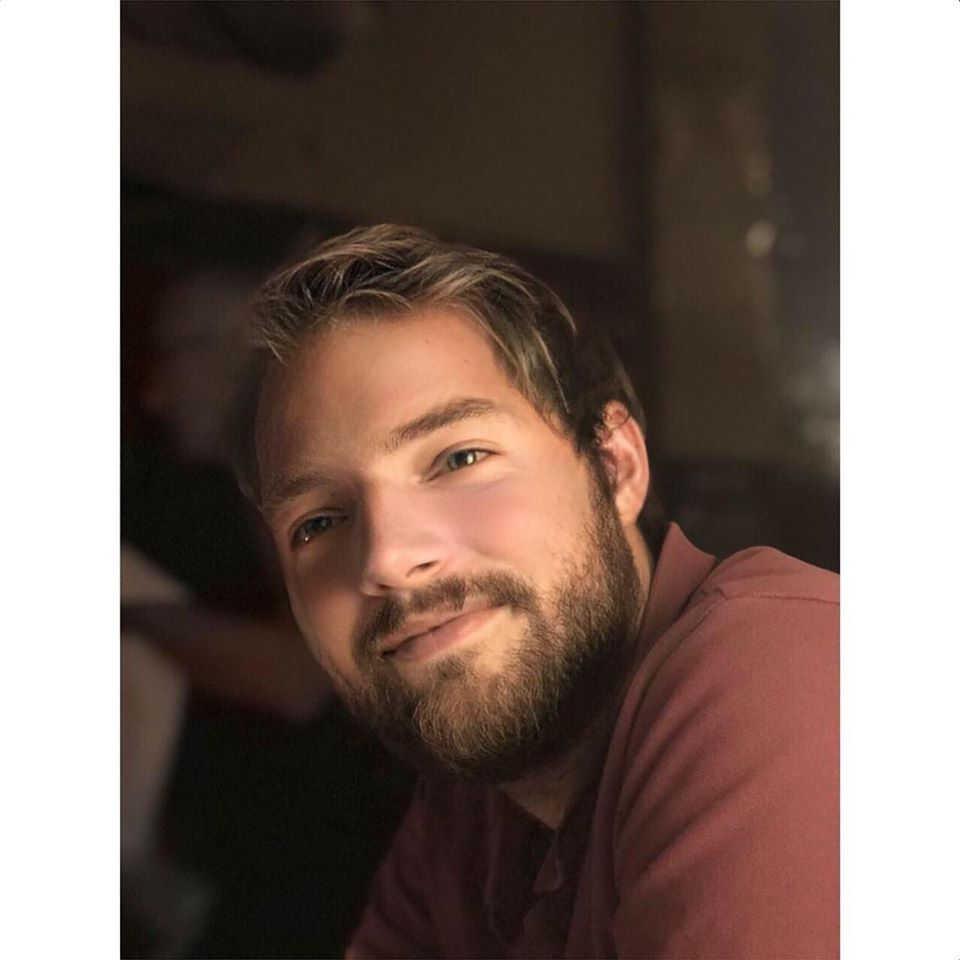
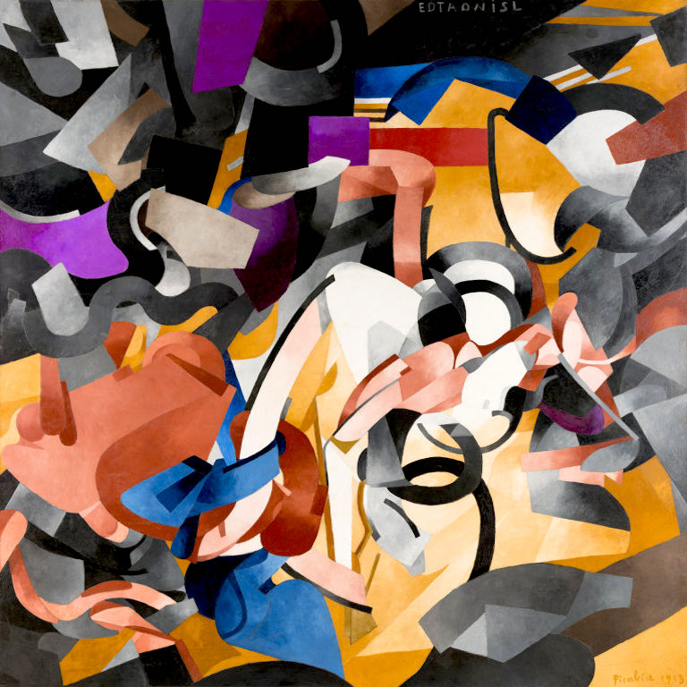
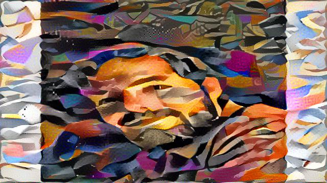
</div>


## Future improvements

As you can see on the given examples, this basic version of Neural Style Transfer works well "globally"
(e.g landscapes etc.) but not as well in specific scenarios (e.g faces). Goal is to improve system to
perform better style transfer on faces (by for example using semantic segmentation).

Potential options:

[Combining
markov random fields and convolutional neural networks for
image synthesis](https://arxiv.org/pdf/1601.04589.pdf)

[Visual Attribute Transfer through Deep Image Analogy](https://arxiv.org/pdf/1705.01088.pdf)

[Semantic Style Transfer and Turning Two-Bit Doodles into Fine Artwork](https://arxiv.org/pdf/1603.01768.pdf) 


